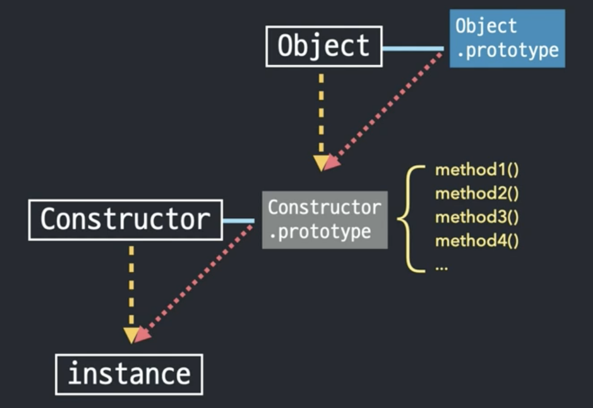

# 06 프로토타입 🤔

태그: 2021년 10월 7일

## Prototype

- New Constructor[Prototype] → Instance
- [1, 2, 3].constructor
⇒ [1, 2, 3].[[Prototype]].constructor
⇒ Array.prototype.constructor
⇒ Array
- 인스턴스가 아닌 경우에도 메서드를 사용하는 등 인스턴스처럼 사용하면
자바스크립트가 임시로 생성자 함수의 인스턴스를 만들어 그 프로토타입에 있는 메서드를 적용하고
다시 인스턴스를 제거한다.
    - 기본형 데이터들은 이와 같은 방식으로 메서드를 호출할 수 있다.
    - 참조형 데이터들은 처음부터 인스턴스이므로 이와 같은 과정을 거칠 필요가 없다.
- 어떠한 데이터든 메서드에 접근하려면 이런 구조가 된다.
    - 데이터 자신에게는 메서드들이 없지만, 생성자 함수의 프로토타입 프로퍼티에 있는 것을 자신의 것처럼 사용할 수 있다. (null, undefined 제외)
- 각 생성자 함수의 프로토타입에는 각 데이터 타입에 해당하는 전용 메서드가 정의되어있다.
- 인스턴스로부터 프로토타입 프로퍼티에 직접 접근할 수 있는 방법?
    
    ```jsx
    function Person(n, a) {
    	this.name = n;
    	this.age = a;
    }
    
    // 생성자 함수에 접근하는 5가지 방법
    let sky = new Person('sky', 20);
    let clone1 = new sky.__proto__.constructor('clone1', 19);
    let Clone2 = new sky.constructor('clone2', 21);
    let clone3 = new Object.getPrototypeOf(sky).constructor('clone3', 18);
    let clone4 = new Person.prototype.constructor('clone4', 22);
    ```
    
    - `instance.__proto__`
    - `Object.getPrototypeOf(instance)`
- 메소드 상속 및 동작 원리
    
    ```jsx
    function Person(n, a) {
    	this.name = n;
    	this.age = a;
    }
    
    let sky = new Person('sky', 20);
    let min = new Person('min', 19);
    
    sky.setOlder = function() {
    	this.age += 1;
    }
    sky.getAge = function() {
    	return this.age;
    }
    min.setOlder = function() {
    	this.age += 1;
    }
    min.getAge = function() {
    	return this.age;
    }
    ```
    
    ```jsx
    function Person(n, a) {
    	this.name = n;
    	this.age = a;
    }
    
    let sky = new Person('sky', 20);
    let min = new Person('min', 19);
    
    Person.prototype.setOlder = function() {
    	this.age += 1;
    }
    Person.prototype.getAge = function() {
    	return this.age;
    }
    ```
    
    - 장점
        - 메모리 용량 최적화
        - 특정 집단의 공통된 속성 파악
- Prototype Chaining
    
    
    
    - 모든 데이터 타입은 이와 동일한 구조를 따른다.
    - 모든 데이터 타입에 대해 [[Prototype]]으로 연결된 Object.prototype에는 
    자바스크립트 전체를 통괄하는 공통된 메서드들이 정의되어 있다.
    → 여기에는 모든 데이터 타입이 프로토타입 체이닝을 통해 접근 가능하다.
    - 때문에 객체의 프로토타입에는 객체 전용 메서드를 정의해둘 수 없다.
        
        → 객체 생성자 함수에 직접 메서드를 정의한다.
        
        → 그래서 객체에 관련된 명령어들이 유독 메서드를 직접 호출하는 것이 아니라, 
            Object.명령어를 호출해 매개변수로 객체 자신을 넘겨주는 경우가 많았다.
            `obj.freeze();` → `Object.freeze(obj);`
        
    - 메서드를 호출하면 인스턴스 자기 자신에서 먼저 찾아보고, 다음으로 생성자 함수의 프로토타입에서 찾아보고, 최종적으로 객체의 프로토타입에서 찾아 실행한다.
        
        → 프로토타입 체인을 타면서 가장 먼저 발견된 메서드를 실행한다.