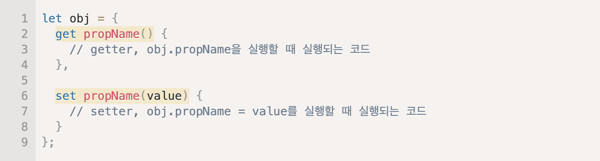

# Question List

태그: 2021년 9월 27일

1. 01 single page application
    
    [01 JavaScript의 역사](https://www.notion.so/01-JavaScript-191c46a0631f4da18afa41df462baa3b) 
    
    [SPA & Routing | PoiemaWeb](https://poiemaweb.com/js-spa)
    
    - 서버로부터 새로운 페이지를 불러오지 않고 현재의 페이지를 동적으로 다시 작성
    - 장점
        - 배포가 간단함
        - 네이티브 앱과 유사한 수준으로 사용자 경험 향상
    - 단점
        - 초기 구동 속도가 느림
        → 트래픽 감소, 속도, 사용성, 반응성 향상 등의 장점이 더 큼
        - SEO issue : 검색엔진 최적화 문제 (클라이언트 렌더링 방식)
        → 정보 제공을 위한 웹페이지보다는 애플리케이션에 적합하기 때문에 심각한 issue는 아님
        - URL이 변경되지 않아 history 관리 불가 ← SEO issue의 원인
    - 다른 방식과의 차이점? 🤔
        
        [20210915](https://www.notion.so/20210915-9ac7af583d1347c79353676c86cb3629)  **페이지 렌더링 방식**
        
        - 기존 : ??
        - 현재 : ??
    
2. class, object, instance
    - Class
        - 객체를 생성하기 위한 틀
        - 서로 연관된 변수와 메서드의 집합
        - 속성 → 멤버변수, 기능 → 메서드
    - Object
        - "실체"
        - 속성과 기능으로 구성
        - 객체는 클래스의 인스턴스
        - 클래스의 타입으로 선언되었을 때
    - Instance
        - "관계"
        - 객체가 만들어지는 과정 → 인스턴스화
        - 인스턴스는 객체에 포함
        - 메모리에 할당되어 실제로 사용될 때
    
3. 03 symbol (식별자의 사용)
    
    [03 JavaScript의 Data Type](https://www.notion.so/03-JavaScript-Data-Type-2e9b78a2c61f4f468b86cfd64e3a0b72) 
    
    - object properties의 식별이 목적
    - primitive data type (원시 데이터 형)
    
    ```jsx
    const symbol1 = Symbol();
    console.log(typeof symbol1); // -> symbol
    
    const symbol2 = Symbol(24);
    console.log(symbol2 === 24); // -> false
    
    const symbol3 = Symbol('sky');
    console.log(symbol3.toString()); // -> Symbol(sky)
    
    console.log(Symbol('sky') === Symbol('sky'));
    // -> false, 모든 symbol 값은 고유함
    ```
    
    - new Symbol()을 지원하지 않음
    - 괄호 안에 들어가는 값은 어떤 의미?
        - symbol에 대한 설명, 디버깅에 사용
        - symbol에 접근하는 용도 X
    - **symbol.length**? 🤔
        
        [Symbol - JavaScript | MDN](https://developer.mozilla.org/ko/docs/Web/JavaScript/Reference/Global_Objects/Symbol)
        
    
4. 05 Rest Parameters (가변 인자)
    
    [05 Function의 선언과 표현](https://www.notion.so/05-Function-886e2bbfa7bb4606963334e05a127403) 
    
    - 매개변수의 최대 갯수가 지정되지 않음
    - Last Parameter 앞에 ...을 붙여 정의
    `ex) function a(...args) {}`
    - **arguments 객체와 차이점**..? 🤔
        
        [Rest 파라미터 - JavaScript | MDN](https://developer.mozilla.org/ko/docs/Web/JavaScript/Reference/Functions/rest_parameters)
        
    
5. 05 10 11 callback 정확히?
    
    [10 JSON의 개념과 활용](https://www.notion.so/10-JSON-fda7776bac504c58851601fab632312f) 
    
    [11 비동기 처리의 시작, Callback](https://www.notion.so/11-Callback-fea916edf90e466a982d467f0c795daf) 
    
    - 다른 함수의 인자로 이용되는 함수
    - 어떤 이벤트에 의해 호출되는 함수
    - **예시**? 🤔
    - 함수 안에서 호출되면 callback 함수?
    
6. 05 함수를 변수에 저장하는 이유?
`ex) const a = function b () {};`
    - 외부에서 호출할 수 없게?
    - 일회용?
    
7. 05 Recursions (재귀)
    - 정의할 때 자신을 참조, 호출
    - 종료 조건 꼭 포함 (무한 루프 방지)
    - 가독성이 좋음
    - 메모리 많이 차지 → 반복문에 비해 성능 낮음
    
    
    
    - **꼬리 재귀**? 🤔
        - 재귀 함수의 메모리와 성능 문제 해결
        - 컴파일러가 최적화 → 반복문으로 변경
        - 일반 재귀 : 재귀 호출 이후 추가 연산 필요
        꼬리 재귀 : 재귀 호출 이후 연산 없음
    
8. 06 getter와 setter의 역할
    
    [06 Class와 Object의 차이점](https://www.notion.so/06-Class-Object-aaa2f92ac616424c98ba37f9fdc646e7) 
    
    - 외부에서의 객체 데이터 접근을 막음
    → 나이를 음수로 설정하는 등 객체 무결성이 깨질 수 있기 때문
    - 메서드를 통해 데이터에 접근하도록 유도
    - Setter
        - 외부에서 객체의 데이터를 변경할 때
        - 매개값을 검증하여 유효한 값만 데이터로 저장
    - Getter
        - 외부에서 객체의 데이터를 읽을 때
        - 외부에서 사용하기 부적절한 필드값을 가공 후 전달
    - 예시) Class 선언 시 필드를 private로 선언하여 보호하고 Getter&Setter 메서드를 작성
    - 변수 이름을 구분해주어야 하는 이유 & call stack이 오버되는 이유
        - `this.var` → get() 호출
        - `this.var = value` → set(value) 호출
        → setter 무한 루프 😰 → 변수명 앞에 _를 붙여 구분
        
        
        
    
9. 07 Property Value Shorthand vs Constructor Function, Class와 어떤 상관관계?
    
    [07 Object란?](https://www.notion.so/07-Object-04852b93cab14d63b887e9cd9e61a511) 
    
    - 
    
10. 07 Cloning
    
    ```jsx
    const user = { name: 'sky', age: '18' };
    const user2 = user; // user2는 user를 가리킴
    ```
    
    - 변수에 Object를 할당하면 Object 자체가 아니라 Object를 가리키는 주소 값(Reference)이 할당됨
    
11. 08 forEach
    
    [08 Array의 개념](https://www.notion.so/08-Array-5f921ce8aa4546f48d8f8b8ac0949728) 
    
    - Array 객체에서만 사용하는 메서드
    - callback 함수 → 파라미터
    - 배열의 각 요소들이 반복될 때마다 callback 함수 호출
    
12. 08 - 09 실습
    
    [09 유용한 10가지 Array Functions](https://www.notion.so/09-10-Array-Functions-7c17f7bee7d048a885951aed227671d2) 
    
13. 12 promise 개념.. <- callback 먼저 이해해야할듯
    
    [12 Promise의 개념과 활용](https://www.notion.so/12-Promise-ae61454d56c04bd389559a9019a91fc1) 
    
14. return은 어떤 상황에 필요?
    - void